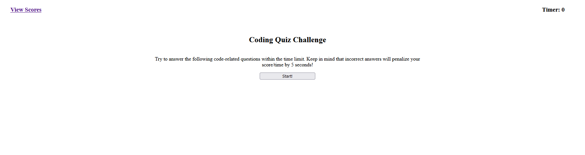

# Code Quiz

<a href="https://raealejandrino.github.io/codequiz/">Code Quiz Link</a>

## The repository

This repository is where I (Rae Alejandrino) write, edit, and implement a code quiz using JavaScript, HTML, and CSS.

## Code Quiz

In this repository, you can find a <a href="https://raealejandrino.github.io/codequiz/">live</a> url deployment of a coding quiz which tests the user on their coding knowledge! Upon vising the web address, you can click on the **"Start"** button and begin the code quiz where each question that's presented will require the user to select from the list of answers shown below the question. Upon initializing the quiz, a timer will begin with 60 seconds, which will evaluate the user's score once completing the quiz. If the user selects the wrong answer, **5 seconds** will be removed from the timer. At the end of the quiz, the user will have the option of submitting their scores and initials which are logged into the localStorage database.